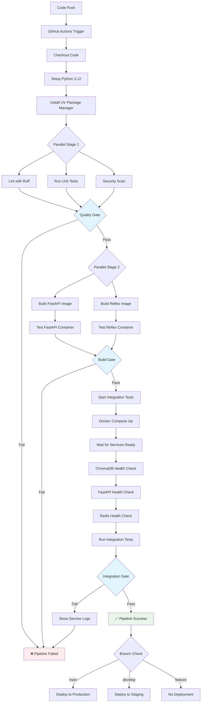

# CI/CD Architecture for VINO Project Docker Services

## Desire

The VINO project requires a modern, efficient CI/CD pipeline that supports:

- **Multi-Service Architecture**: Independent building and testing of FastAPI backend and Reflex frontend services
- **Development Velocity**: Rapid feedback loops for developers with parallel build processes
- **Quality Assurance**: Comprehensive testing including unit tests, integration tests, and end-to-end service validation
- **Production Readiness**: Automated deployment with proper service orchestration and health checks
- **Developer Experience**: Clear feedback, fast builds, and reliable deployment processes
- **Infrastructure as Code**: Reproducible environments using Docker Compose with proper service dependencies

The goal is to create a CI/CD pipeline that enables confident, frequent deployments while maintaining high code quality and system reliability. Developers should be able to push code and trust that the automated pipeline will catch issues before they reach production.

## Ascertainment

### Current Development Workflow Analysis

After analyzing the VINO project structure and requirements, we identified these development patterns:

1. **Dual Service Architecture**: 
   - FastAPI backend (`src/`) with dependencies on ChromaDB and Redis
   - Reflex frontend (`reflex_ui/`) that communicates with the FastAPI backend
   - Shared dependencies managed through `pyproject.toml` and `uv.lock`

2. **Technology Stack Requirements**:
   - Python 3.12 with UV package manager for fast dependency resolution
   - Docker multi-stage builds for optimized container images
   - External service dependencies (ChromaDB, Redis) requiring orchestration
   - Environment-specific configurations for development vs production

3. **Testing Complexity (WIP)**:
   - Unit tests for individual service logic 
   - Integration tests requiring multiple services running simultaneously
   - End-to-end tests validating API endpoints and service communication
   - Health checks ensuring services are ready before dependent services start

4. **Deployment Challenges**:
   - Service interdependencies requiring proper startup ordering
   - Environment variable management across different deployment contexts
   - Container registry management and image versioning
   - Zero-downtime deployments with proper health checks

### Current Pain Points

- Manual Docker builds slow down development iteration
- Integration testing requires complex local service orchestration
- No automated deployment pipeline for production environments
- Limited visibility into build failures and service health
- Inconsistent environment configurations between development and production

## Thesis

### Multi-Stage CI/CD Pipeline Architecture

We implement a comprehensive CI/CD pipeline with three distinct stages optimized for the dual-service architecture:

#### Stage 1: Code Quality & Unit Testing
- Parallel linting and formatting with Ruff
- Unit test execution with pytest
- Dependency vulnerability scanning
- Code quality metrics and reporting

#### Stage 2: Service Build & Validation
- Parallel Docker image builds for FastAPI and Reflex services
- Individual service health checks and validation
- Image security scanning with Trivy
- Build artifact caching for faster subsequent builds

#### Stage 3: Integration & Deployment
- Full service orchestration with Docker Compose
- End-to-end integration testing
- Production deployment with health monitoring
- Rollback capabilities and deployment verification

### Docker-First Development Strategy

The pipeline leverages Docker as the primary deployment mechanism:

1. **Separate Dockerfiles**: `Dockerfile.fastapi` and `Dockerfile.reflex` for service-specific optimizations
2. **Multi-Environment Compose**: Different compose files for development, testing, and production
3. **Build Optimization**: Layer caching, multi-stage builds, and dependency pre-installation
4. **Service Orchestration**: Proper dependency management with health checks and startup ordering

### Continuous Integration Workflow

```yaml
# Three-stage pipeline with parallel execution where possible
Trigger: Push to main/develop, Pull Requests to main
├── Stage 1: Quality (Parallel)
│   ├── Lint & Format (Ruff)
│   ├── Unit Tests (pytest)
│   └── Security Scan (Bandit)
├── Stage 2: Build (Parallel, depends on Stage 1)
│   ├── Build FastAPI Image
│   ├── Build Reflex Image
│   └── Image Security Scan
└── Stage 3: Integration (Sequential, depends on Stage 2)
    ├── Compose Up All Services
    ├── Health Check Verification
    ├── Integration Test Suite
    └── Deployment (main branch only)
```

### Deployment Strategy

- **Feature Branches**: CI only (no deployment)
- **Develop Branch**: Deploy to staging environment
- **Main Branch**: Deploy to production with approval gates
- **Release Tags**: Versioned production deployments

## Example

### Complete CI/CD Pipeline Flow

Here's how the CI/CD pipeline handles a typical development workflow:

```bash
# Developer pushes code to feature branch
git push origin feature/chat-improvements
```

### Pipeline Execution Flow



### Stage 1: Code Quality Pipeline

```yaml
# .github/workflows/ci.yml - Quality Stage
lint-and-test:
  runs-on: ubuntu-latest
  steps:
    - uses: actions/checkout@v4
    - uses: actions/setup-python@v5
      with:
        python-version: '3.12'
    
    - name: Install UV
      run: |
        curl -LsSf https://astral.sh/uv/install.sh | sh
        echo "$HOME/.cargo/bin" >> $GITHUB_PATH
    
    - name: Install dependencies
      run: |
        uv sync --locked
        uv pip install pytest ruff python-dotenv
    
    - name: Lint and format
      run: |
        uv run ruff check --fix
        uv run ruff format --check
    
    - name: Run unit tests
      run: |
        uv run pytest tests/ -v --cov=src --cov-report=xml
```

### Stage 2: Docker Build Pipeline

```yaml
# Parallel matrix build for both services
docker-build:
  runs-on: ubuntu-latest
  needs: lint-and-test
  strategy:
    matrix:
      service: [fastapi, reflex]
  steps:
    - uses: actions/checkout@v4
    - uses: docker/setup-buildx-action@v3
    
    - name: Build service image
      run: |
        docker build -f Dockerfile.${{ matrix.service }} \
          -t vino-${{ matrix.service }}:${{ github.sha }} .
    
    - name: Test service container
      run: |
        docker run --rm -d --name test-${{ matrix.service }} \
          vino-${{ matrix.service }}:${{ github.sha }}
        sleep 10
        
        # Service-specific health checks
        if [ "${{ matrix.service }}" = "fastapi" ]; then
          docker exec test-${{ matrix.service }} \
            curl -f http://localhost:8000/health
        fi
        
        docker stop test-${{ matrix.service }}
```

### Stage 3: Integration Testing

```yaml
# Full service orchestration testing
integration-test:
  runs-on: ubuntu-latest
  needs: docker-build
  steps:
    - uses: actions/checkout@v4
    
    - name: Create environment file
      run: |
        cat > .env << EOF
        GOOGLE_API_KEY=${{ secrets.GOOGLE_API_KEY }}
        CHROMA_HOST=chromadb
        CHROMA_PORT=8000
        REDIS_HOST=redis
        REDIS_PORT=6379
        EOF
    
    - name: Start all services
      run: |
        docker-compose build
        docker-compose up -d
    
    - name: Wait for service readiness
      run: |
        # Robust health checking with timeouts
        timeout 60 bash -c 'until curl -f http://localhost:8001/api/v1/heartbeat; do sleep 2; done'
        timeout 60 bash -c 'until curl -f http://localhost:8000/health; do sleep 2; done'
        timeout 60 bash -c 'until nc -z localhost 6379; do sleep 2; done'
    
    - name: Run integration test suite
      run: |
        # Test core API endpoints
        curl -f http://localhost:8000/health
        curl -f http://localhost:8000/v1/admin/files
        
        # Test chat functionality
        curl -X POST http://localhost:8000/v1/chat \
          -H "Content-Type: application/json" \
          -d '{
            "session_id": "ci-test-session",
            "query_text": "Test chat functionality",
            "history": [],
            "current_step": 1
          }'
        
        # Test file upload
        curl -X POST http://localhost:8000/v1/upload_document \
          -F "file=@tests/fixtures/sample.txt"
```

### Production Deployment Pipeline

```yaml
# Production deployment with safety checks
deploy-production:
  runs-on: ubuntu-latest
  needs: integration-test
  if: github.ref == 'refs/heads/main'
  environment: production
  steps:
    - name: Deploy to production
      run: |
        # Build production images
        docker-compose -f docker-compose.prod.yml build
        
        # Rolling update with health checks
        docker-compose -f docker-compose.prod.yml up -d
        
        # Verify deployment
        timeout 120 bash -c 'until curl -f https://api.vino-project.com/health; do sleep 5; done'
        
    - name: Post-deployment verification
      run: |
        # Smoke tests on production
        curl -f https://api.vino-project.com/health
        curl -f https://vino-project.com # Frontend health
        
        # Performance baseline check
        curl -w "@curl-format.txt" -o /dev/null -s https://api.vino-project.com/health
```

### Local Development Integration

The CI/CD pipeline is designed to mirror local development workflows:

```bash
# Local development commands that match CI pipeline
# Stage 1: Quality checks (matches CI lint-and-test job)
uv run ruff check --fix
uv run ruff format
uv run pytest tests/ -v

# Stage 2: Build services (matches CI docker-build job)
docker build -f Dockerfile.fastapi -t vino-fastapi:local .
docker build -f Dockerfile.reflex -t vino-reflex:local .

# Stage 3: Integration testing (matches CI integration-test job)
docker-compose up -d
curl -f http://localhost:8000/health
curl -f http://localhost:8001/api/v1/heartbeat
```

### Pipeline Monitoring and Feedback

The CI/CD system provides comprehensive feedback:

**Success Notifications:**
- ✅ All tests passing with coverage reports
- ✅ Docker images built and tested successfully  
- ✅ Integration tests completed with service health confirmed
- ✅ Production deployment verified and healthy

**Failure Diagnostics:**
- ❌ Specific test failures with detailed logs
- ❌ Docker build failures with layer-by-layer analysis
- ❌ Service startup issues with container logs
- ❌ Integration test failures with service state dumps

**Performance Metrics:**
- Build time optimization (target: <5 minutes total pipeline)
- Test execution time tracking
- Docker layer caching effectiveness
- Deployment time monitoring

This approach ensures developers receive fast, actionable feedback while maintaining confidence in the deployment process through comprehensive testing and validation at each stage.
