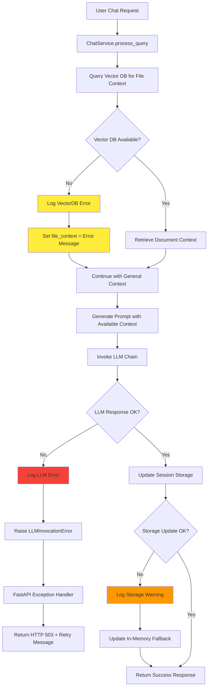

# Error Handling Architecture for ChatService

## Goal

The VINO AI system requires a robust, production-ready error handling architecture that provides:

- **Graceful Degradation**: When external services fail, the system should continue operating with reduced functionality rather than complete failure
- **Clear Error Boundaries**: Different types of failures should be handled at appropriate levels with specific recovery strategies
- **Observability**: All errors should be logged with sufficient context for debugging and monitoring
- **User Experience**: API consumers should receive meaningful error messages without exposing internal system details
- **Service Resilience**: Critical chat functionality should remain available even when auxiliary services (persistent storage, vector DB) encounter issues

The goal is to create a fault-tolerant system where users can continue having conversations even when components fail, while maintaining data integrity and providing clear feedback about system status.

## Current State (Ascertainment)

### Current Error Landscape Analysis

After analyzing the ChatService implementation and its dependencies, we identified several failure domains:

1. **LLM Service Failures**: Google Generative AI API unavailability, authentication issues, rate limiting
2. **Vector Database Failures**: ChromaDB connection issues, query failures, indexing problems
3. **Session Storage Failures**: Supabase connectivity issues, database constraints, network timeouts
4. **Prompt Generation Failures**: Template rendering issues, context overflow, invalid parameters
5. **Document Processing Failures**: File parsing errors, encoding issues, memory constraints

### Error Propagation Patterns

The system exhibits these error propagation patterns:

- **Initialization Errors**: Critical failures that prevent service startup (API keys, database connections)
- **Runtime Errors**: Recoverable failures during operation (network timeouts, temporary service unavailability)
- **Data Integrity Errors**: Issues that could corrupt conversation state or document indexes
- **Resource Exhaustion**: Memory limits, token limits, rate limits

### Fallback Requirements

Based on usage patterns, we determined these fallback priorities:

1. **Core Chat Functionality**: Must remain available even with degraded features
2. **Conversation History**: Should persist in-memory if persistent storage fails
3. **Context Retrieval**: Should gracefully handle missing document context
4. **Session Management**: Should continue with reduced persistence guarantees

## Thesis (Solution approach)

### Hierarchical Exception Architecture

We implement a hierarchical custom exception system with specific recovery strategies at each level:

```python
VinoError (Base)
├── LLMError
│   ├── LLMInitializationError    # Critical - Blocks service startup
│   └── LLMInvocationError        # Recoverable - Retry with backoff
├── PromptGenerationError         # Recoverable - Use fallback templates
├── SessionStorageError           # Graceful degradation - Use in-memory
├── SupabaseServiceError          # Graceful degradation - Local fallback
├── VectorDBError                 # Graceful degradation - No context retrieval
└── DocumentProcessingError       # User-facing - Clear error message
```

### Error Handling Strategies by Domain

#### 1. LLM Errors
- **LLMInitializationError**: Critical failure, blocks service startup
- **LLMInvocationError**: Retry with exponential backoff, eventual user notification

#### 2. Storage Errors
- **SessionStorageError**: Automatic fallback to in-memory storage
- **SupabaseServiceError**: Continue with reduced persistence guarantees

#### 3. Context Retrieval Errors
- **VectorDBError**: Continue conversation without enhanced context
- **DocumentProcessingError**: Clear user feedback about file issues

#### 4. System Integration
- **FastAPI Exception Handlers**: Automatic HTTP status code mapping
- **Structured Logging**: Correlation IDs, error context, recovery actions

### Fault Tolerance Mechanisms

1. **Circuit Breaker Pattern**: Automatic service isolation when failure rates exceed thresholds
2. **Graceful Degradation**: Core functionality continues with reduced features
3. **Automatic Recovery**: In-memory fallbacks when persistent services fail
4. **Error Boundaries**: Exceptions caught at appropriate service boundaries

## Example

### Scenario: Complete Vector Database Failure

Here's how the system handles a complete ChromaDB failure during a chat conversation:

```python
# User initiates chat with document context request
POST /v1/chat
{
    "session_id": "user-123",
    "query_text": "Summarize the key points from the uploaded document",
    "uploaded_file_context_name": "quarterly-report.pdf"
}
```

### Error Flow with Recovery



### Code Implementation

```python
# In ChatService.process_query()
def process_query(self, session_id: str, query_text: str, uploaded_file_context_name: Optional[str] = None):
    try:
        # Attempt to load file context
        file_context = ""
        if uploaded_file_context_name:
            try:
                file_results = self.vector_db_service.query_collection(
                    collection_name=settings.USER_DOCUMENTS_COLLECTION_NAME,
                    query_text=query_text,
                    where={"filename": uploaded_file_context_name}
                )
                file_context, has_results = self._add_results_to_context(
                    file_results, f"Relevant Information From {uploaded_file_context_name}"
                )
                logger.info(f"File context loaded for: {uploaded_file_context_name}")
            except Exception as e:
                # Graceful degradation: Continue without file context
                logger.error(f"Error loading file context for '{uploaded_file_context_name}': {e}", exc_info=True)
                file_context = f"\n--- File Context from {uploaded_file_context_name} ---\n"
                file_context += f"[Error loading file context: {str(e)}]\n"
        
        # Continue with LLM invocation regardless of context retrieval success
        chain = prompt_template | self.llm
        response_message = chain.invoke({"history": history, "question": query_text})
        
        # Attempt to persist session
        try:
            self._update_session_data(session_id, updated_history, current_step, planner)
        except Exception as e:
            # Graceful degradation: Use in-memory storage
            logger.warning(f"Failed to persist session '{session_id}', using in-memory fallback: {e}")
            self.conversation_history[session_id] = updated_history
            self.current_process_step[session_id] = current_step
            
        return response_content, api_history, current_step, planner
        
    except Exception as e:
        logger.error(f"Critical error in ChatService.process_query: {e}", exc_info=True)
        raise LLMInvocationError(f"Failed to process chat request: {str(e)}") from e
```

### FastAPI Exception Handler Response

```python
@app.exception_handler(LLMInvocationError)
async def llm_invocation_exception_handler(request: Request, exc: LLMInvocationError):
    logger.error(f"LLM invocation failed for {request.url}: {exc.message}")
    return JSONResponse(
        status_code=503,
        content={
            "detail": "The AI service is temporarily unavailable. Please try again in a moment.",
            "error_type": "service_unavailable",
            "retry_after": 30
        }
    )
```

### User Experience

**Successful Recovery (Vector DB Failed, LLM Succeeded):**
```json
{
    "response": "I apologize, but I couldn't access the specific document 'quarterly-report.pdf' due to a technical issue. However, I can still help you with general questions. Could you provide some key details from the document that you'd like me to analyze?",
    "current_step": 2,
    "planner_details": null,
    "context_sources": []
}
```

**Complete Failure (LLM Also Failed):**
```json
{
    "detail": "The AI service is temporarily unavailable. Please try again in a moment.",
    "error_type": "service_unavailable",
    "retry_after": 30
}
```

### Monitoring and Observability

The error handling system provides structured logging for monitoring:

```python
# Success with degraded functionality
logger.warning(f"Session '{session_id}' continuing with degraded functionality: Vector DB unavailable")

# Critical error requiring attention
logger.critical(f"LLM initialization failed - service startup blocked", exc_info=True)

# Recovery action taken
logger.info(f"Session '{session_id}' recovered using in-memory storage fallback")
```

This approach ensures users receive a responsive system that gracefully handles failures while providing operations teams with clear visibility into system health and recovery actions.
