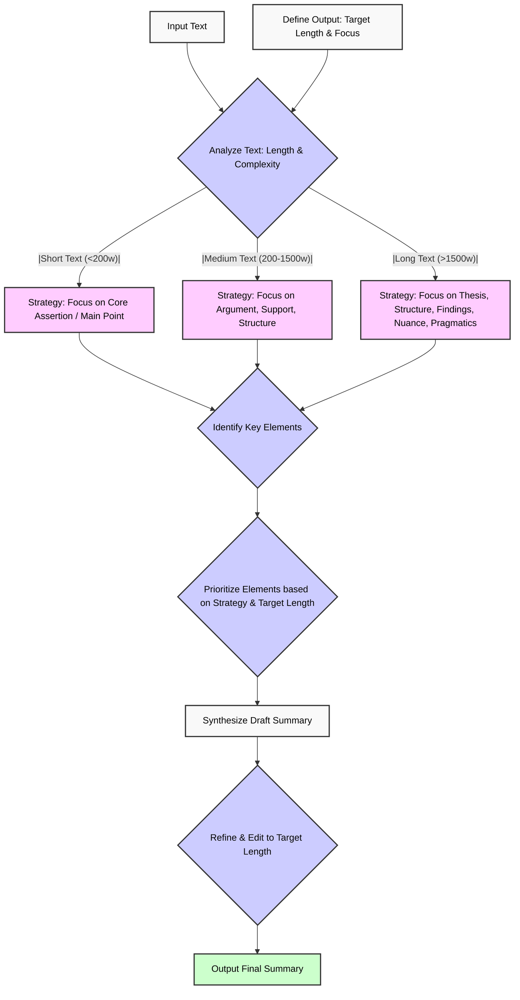

# Process Description

- [Process Description](#process-description)
  - [AI Micro-Service Architecture](#ai-micro-service-architecture)
    - [Notes](#notes)
    - [Sequence Diagram](#sequence-diagram)
  - [Chunking](#chunking)
  - [Summarization](#summarization)
  - [Prompting Strategy](#prompting-strategy)
    - [Proposed Prompting Possibilities](#proposed-prompting-possibilities)
  - [Diagram Prompting Logic](#diagram-prompting-logic)


## AI Micro-Service Architecture

### Notes

The coding challenge proposes a simple api endpoint that is able to return a summary of a given text, and also the similarity of two texts.

Sounds like building blocks to building a system for making a knowledge bucket open to be structured in certain ways.

Semantic similarity is good for retrieval, which can be sped up by having concise and 'accurate summaries' of larger corpses of text.

### Sequence Diagram

A first diagram can be thought of as there were multiple rules; Fast API, Docker, OpenAI API, PyTests

Though solely focused on the features, some stretch goals are logical to implement because of scaling/production features.

Vector Store is the bread and butter of vector storage; Summarization can be used for abstraction, streaming and it should be rate-limited as to not overwhelm the system.

```mermaid
sequenceDiagram
    participant Client as Text Input
    participant API as FastAPI
    participant Service as Summary/Semantic
    participant Store as Vector Store

    Client->>API: POST /process\n(submit text(s))
    API->>Service: summarize(text)
    Service-->>API: summary
    API->>Service: compute_similarity(text1, text2)
    Service-->>API: similarity_score
    API->>Store: upsert_vectors(summary, embeddings)
    Store-->>API: acknowledgment
    API-->>Client: 200 OK\n{ summary, similarity_score }

 ```

 Looking at this diagram, it's easy to just leave out the vector store.


```mermaid
sequenceDiagram
    participant Client as Text Input
    participant API as FastAPI
    participant Service as Summary/Semantic
    Client->>API: POST /process\n(submit text(s))
    API->>Service: summarize(text)
    Service-->>API: summary
    API->>Service: compute_similarity(text1, text2)
    Service-->>API: similarity_score
    API-->>Client: 200 OK\n{ summary, similarity_score }

 ```

 And we can focus on the core functionalities.

 This could expand or be used as a reusable component for other applications, features, or use cases.

 Zooming in, the Summary/Semantic techniques will need some extra attention, as this will be the bottleneck for most applications. 

Things to consider:
* Chunking Strategies
* Similarity Strategies
* Summary Strategies
  
## Chunking

Optimal chunking depends on use case. Assuming the use case of modularity, all-roundedness the implementation needs to leave doors open for other use cases.

Though certain things are important to consider for every use case:

* Size of Chunks
* Small enough, not too small
* Big enough, as to not lose information
* Nature awareness
* Structure awareness
* No one-size-fits-all solution

Truncation is allievated by large context windows; though does not alleviate semantic representation (quality) and retrieval precision (accuracy).

```mermaid
graph TD
    Start[Unstructured Text Data] --> B{Initial Assessment & Goal};

    B -- Prioritize Simplicity/Speed? --> C[Fixed-Size Chunking];
    B -- Need Balanced Approach (General Text)? --> D[Recursive Character Splitting];
    B -- Need High Semantic Accuracy? --> E{Sufficient Compute Resources?};
    B -- Need Max Context (e.g., for RAG)? --> F{Accept Higher Complexity?};

    C --> G((Evaluate Size vs Context Loss));
    D --> H((Evaluate Size vs Structure Preservation));
    E -- Yes --> I[Semantic Chunking];
    E -- "No (Fallback: resources limited)" --> D;
    F -- Yes --> J[Hierarchical / Parent Document Retriever];
    F -- "No (Fallback: complexity too high)" --> D;

    I --> K((Evaluate Semantic Coherence vs Cost));
    J --> L((Evaluate Context Richness vs Complexity));

    G --> Z[Feed Chunks to Embeddor];
    H --> Z;
    K --> Z;
    L --> Z;

    style Start fill:#eee,stroke:#333,stroke-width:1px, color:#000
    style B fill:#f9f,stroke:#333,stroke-width:2px, color:#000
    style Z fill:#ccf,stroke:#333,stroke-width:2px, color:#000
    style C fill:#ff9,stroke:#333,stroke-width:1px, color:#000
    style D fill:#ff9,stroke:#333,stroke-width:1px, color:#000
    style I fill:#ff9,stroke:#333,stroke-width:1px, color:#000
    style J fill:#ff9,stroke:#333,stroke-width:1px, color:#000
    style E fill:#fcf,stroke:#333,stroke-width:1px, color:#000
    style F fill:#fcf,stroke:#333,stroke-width:1px, color:#000
    style G fill:#9cf,stroke:#333,stroke-width:1px, color:#000
    style H fill:#9cf,stroke:#333,stroke-width:1px, color:#000
    style K fill:#9cf,stroke:#333,stroke-width:1px, color:#000
    style L fill:#9cf,stroke:#333,stroke-width:1px, color:#000

```

This decision diagram will help us evaluate which strategy to use for the implementation.

## Summarization

When summarizing there are multiple ways to do it, the simplest, is the let an LLM to do it. Though, while retaining a set of "30 words", it becomes hard to measure what the LLM focuses on. Seemingly every LLM wil do it differently, depending on their weights, temperature and under the hood training.

To generalize this process, we have to understand two key concepts; semantics vs pragmatics.

There are core challenges to this:

* Loss of nuance
* Compute power
* Is the original text reconstructable based on the summary?

A technique that makes novel summaries is obviously, the use of LLMs. Though there are also others that precede it such as extractive summarization.

Techniques like TF-IDF, TextRank/LexRank, LSA could provide a form of pre-processing the text to provide a concise, densely packed summary.

| Feature                     | TF-IDF          | TextRank (Embeddings) | LSA (Approx. SVD)   | BART/T5 (Large)       | Representative LLM (API/Large) |
|-----------------------------|-----------------|-----------------------|---------------------|-----------------------|--------------------------------|
| Approx. Time Complexity (Inference, per doc) | $O(L)$          | $O(n^2 + iter)$       | $O(T \times S \times k)$ (Approx.) | $O(SeqLen^2)$ (Attn) | Complex, depends on model/gen length |
| Approx. Space Complexity (Memory Usage) | Low             | Medium                | High                | High                  | Very High                      |
| Training Needs              | None/Minimal    | None (Embeddings may need training) | None                | Large (Fine-tuning)   | Massive (Pre-training)         |
| Inference Speed Category    | Very Fast       | Fast                  | Moderate            | Slow                  | Slow / Very Slow               |
| Hardware Intensity          | CPU-bound       | CPU/GPU (Embeddings)  | CPU/Memory-bound    | GPU-bound             | High-end GPU required          |
| Long Document Handling      | Native (Linear scale) | Requires Chunking/Hierarchy ($n^2$) | Requires Chunking/Hierarchy (Matrix size) | Specialized Model/Chunking | Specialized Model/Chunking     |
| Typical Summary Quality (Fluency/Coherence) | Lower           | Moderate              | Moderate            | Higher                | Potentially Highest            |
| Factual Consistency         | High (by nature)| High (by nature)      | High (by nature)    | Lower (Risk of hallucination) | Lower (Risk of hallucination)  |

There exists an overlap in chunking strategies, embeddings and summary. Chunking is closely related to extraction, and in this case, the other 'summarization' methods are over-shadowed when it comes to LLM quality of summaries.

Is it worth pre-processing text while GPT-4.1 has a context window of 1M Tokens? This heavily depends on the use case.

It's an edge case to consider a set of documents that has over 1M tokens in context while being consistently unstructured, that needs structuring and abstraction.

This boils down to the system **prompting strategy**.

## Prompting Strategy

### Proposed Prompting Possibilities

Here are different ways to implement adaptive strategy through prompting:

1.  **Tiered Base Prompts:**
    * **Concept:** Create distinct base prompts for different input length categories.
    * **Example (Short Text):** `Summarize the following paragraph in [target_length] words, focusing on its single main point: [Text]`
    * **Example (Medium Text):** `Provide a [target_length] word summary of this article. Identify the main argument and key supporting points: [Text]`
    * **Example (Long Text):** `Summarize this paper in [target_length] words. Include the main thesis, the overall structure of the argument, key findings, and any significant nuances or conclusions: [Text]`
    * **Pros:**
        * Simple to implement.
    * **Cons:**
        * Less flexible; requires classifying text length accurately beforehand.

2.  **Parameter-Driven Meta-Prompt:**
    * **Concept:** Use one flexible prompt incorporating parameters that guide the AI.
    * **Example:** `You are an expert summarizer. Analyze the provided text (estimated length category: [Short/Medium/Long]). Produce a summary of exactly [target_length] words. Based on the text length, adjust your focus: for short texts, capture the core assertion; for medium texts, outline the main argument and support; for long texts, synthesize the thesis, structure, key findings, and relevant nuance. Text: [Text]`
    * **Pros:**
        * Highly flexible; allows AI to internalize the adaptation logic.
    * **Cons:**
        * Relies heavily on the AI's ability to interpret and follow complex instructions.

3.  **Chain-of-Thought / Step-by-Step Prompting:**
    * **Concept:** Guide the AI through the analysis process explicitly, especially for longer texts.
    * **Example (Long Text):**
        1.  `First, identify the primary thesis or main argument of this paper: [Text]`
        2.  `Next, briefly outline the main sections or structure used to support the thesis.`
        3.  `What are the most critical findings or conclusions presented?`
        4.  `Are there any significant nuances, limitations, or counter-arguments mentioned that are essential for understanding the author's position?`
        5.  `Based on the above points, synthesize a coherent summary of [target_length] words.`
    * **Pros:**
        * More controllable; makes the AI's reasoning process transparent.
    * **Cons:**
        * More interactive; potentially slower; requires multiple prompts.

4.  **Role-Playing with Context:**
    * **Concept:** Assign a role that implies the required level of detail and focus.
    * **Example (Short Summary of Long Text):** `Act as a journalist writing a news brief headline (approx. 30 words) summarizing the core finding of this research paper: [Text]`
    * **Example (Detailed Summary of Long Text):** `Act as a PhD student writing an abstract (approx. 150 words) for this paper, covering the background, methods, results, and conclusion: [Text]`
    * **Pros:**
        * Leverages the AI's world knowledge and role-playing capabilities.
    * **Cons:**
        * Output style might be influenced by the role; relies on the AI understanding the implications of the role for summarization depth.

5.  **Focus Prioritization Prompt:**
    * **Concept:** Explicitly tell the AI how to prioritize different elements based on the goal.
    * **Example:** `Summarize the following text in [target_length] words. Prioritize these elements in order: 1. Core Topic/Thesis, 2. Main Findings/Conclusion, 3. Key Supporting Arguments/Methodology, 4. Structural Overview, 5. Nuance/Context. Include elements only if space permits within the word limit, following the priority order. Text: [Text]`
    * **Pros:**
        * Gives fine-grained control over what gets included or excluded based on brevity constraints.
    * **Cons:**
        * Can be complex to formulate the priority list correctly for every scenario.

Since the use case is unpredictable, tiered-based prompting is most effective, as we can pre-process and analyze the text before getting a response from OpenAI. It is also the most generalistic approach, and doesn't leave out further possible changes to also include context, prioritization, CoT, or paramater driven prompts within Tiered-based prompting.
 
## Diagram Prompting Logic

A general approach of tiered based prompting can be approached like this:

