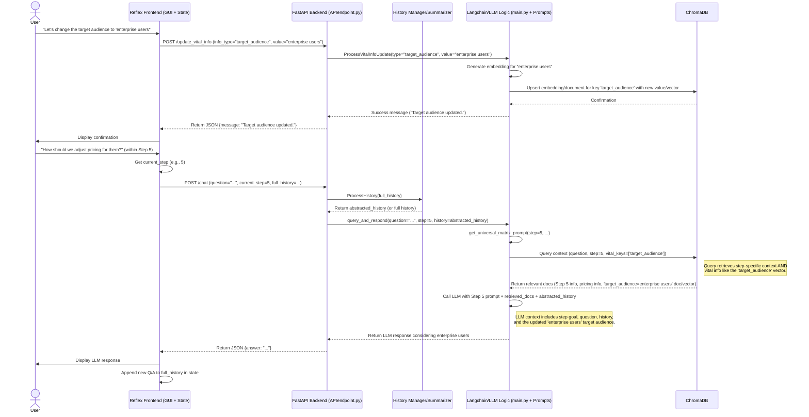
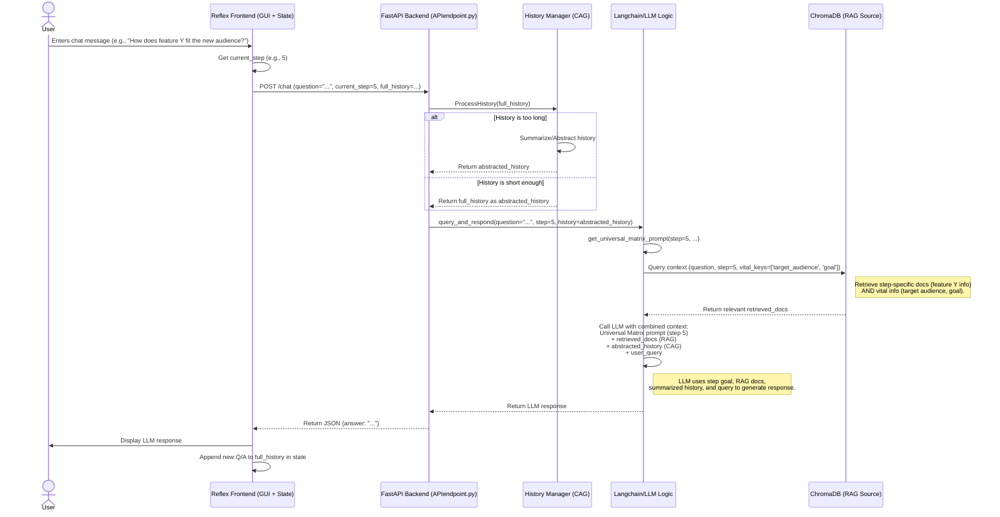
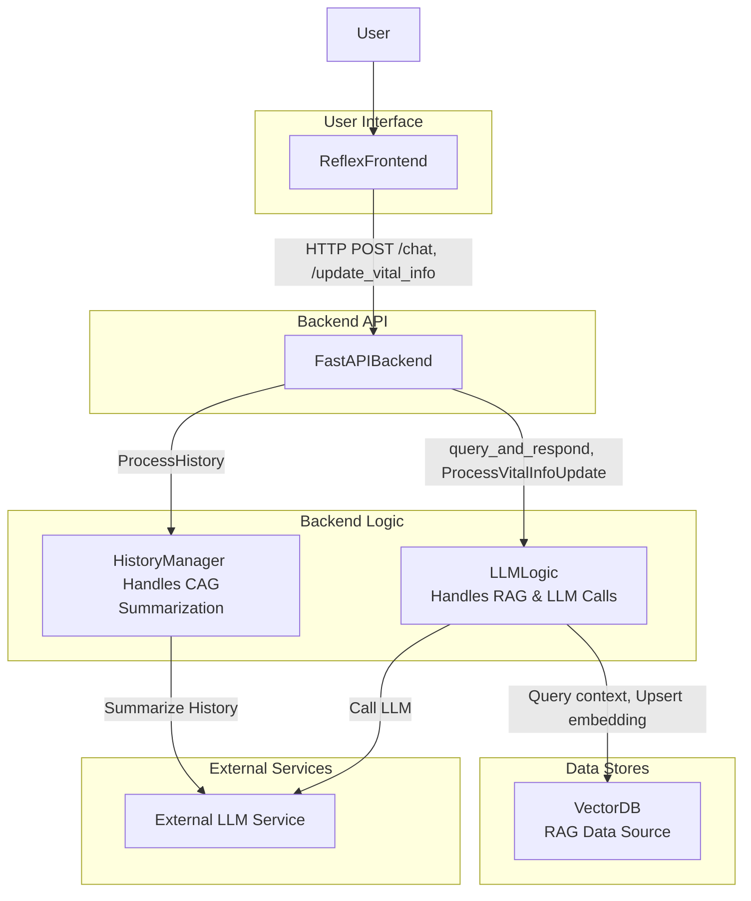

# Context Management
- [Context Management](#context-management)
  - [Initial Context Problem](#initial-context-problem)
    - [Context Length Problem](#context-length-problem)
      - [Potential solution:](#potential-solution)
    - [CAG vs. RAG](#cag-vs-rag)
    - [Leveraging both CAG and RAG](#leveraging-both-cag-and-rag)

## Initial Context Problem


Currently there's an issue with the prompting, and it does not get past step 1 because of the lack of confirmation or command.
In a sequence diagram I want to describe the possible scenarios that happen for chat navigation and steps navigation (1-6)

the user needs to be able to navigate to context of step 1, and if it's good enough;

1. we do /next to go to the next step.
2. to go to any step that exists, do /step x
3. to go to previous step do /previous

Thus, wondering how this is going to interact with our stack.

It creates 3 scenarios:

```mermaid
sequenceDiagram
    actor User
    participant ReflexFrontend as Reflex Frontend (GUI + State)
    participant FastAPIBackend as FastAPI Backend (APIendpoint.py)
    participant LLMLogic as Langchain/LLM Logic (main.py + Prompts)
    participant VectorDB as ChromaDB

    %% Scenario 1: Normal Chat within a Step %%
    User->>ReflexFrontend: Enters chat message "Tell me more about X"
    ReflexFrontend->>ReflexFrontend: Get current_step (e.g., 1)
    ReflexFrontend->>FastAPIBackend: POST /chat (question="...", current_step=1)
    FastAPIBackend->>LLMLogic: query_and_respond(question="...", step=1, history=...)
    LLMLogic->>LLMLogic: get_universal_matrix_prompt(step=1, ...)
    LLMLogic->>VectorDB: Query context relevant to Step 1 + question
    VectorDB-->>LLMLogic: Return relevant documents
    LLMLogic->>LLMLogic: Call LLM with Step 1 prompt + context + history
    LLMLogic-->>FastAPIBackend: Return LLM response for Step 1
    FastAPIBackend-->>ReflexFrontend: Return JSON {answer: "..."}
    ReflexFrontend->>User: Display LLM response for Step 1

    %% Scenario 2: User wants to proceed - /next %%
    User->>ReflexFrontend: Enters command "/next"
    ReflexFrontend->>ReflexFrontend: Parse command, identify "/next"
    ReflexFrontend->>ReflexFrontend: Get current_step (e.g., 1)
    ReflexFrontend->>ReflexFrontend: Increment current_step (to 2)
    ReflexFrontend->>FastAPIBackend: POST /chat (question="Proceed to next step.", current_step=2) # Send a placeholder question or guiding prompt
    FastAPIBackend->>LLMLogic: query_and_respond(question="Proceed to next step.", step=2, history=...)
    LLMLogic->>LLMLogic: get_universal_matrix_prompt(step=2, ...)
    LLMLogic->>VectorDB: Query context relevant to Step 2
    VectorDB-->>LLMLogic: Return relevant documents
    LLMLogic->>LLMLogic: Call LLM with Step 2 prompt + context + history (maybe prompt asks "Okay, let's start Step 2...")
    LLMLogic-->>FastAPIBackend: Return LLM response for Step 2
    FastAPIBackend-->>ReflexFrontend: Return JSON {answer: "Okay, let's start Step 2..."}
    ReflexFrontend->>User: Display LLM response initiating Step 2

    %% Scenario 3: User wants to go back - /previous %%
    User->>ReflexFrontend: Enters command "/previous"
    ReflexFrontend->>ReflexFrontend: Parse command, identify "/previous"
    ReflexFrontend->>ReflexFrontend: Get current_step (e.g., 3)
    ReflexFrontend->>ReflexFrontend: Decrement current_step (to 2, ensure >= 1)
    ReflexFrontend->>FastAPIBackend: POST /chat (question="Go back to previous step.", current_step=2)
    FastAPIBackend->>LLMLogic: query_and_respond(question="Go back to previous step.", step=2, history=...)
    LLMLogic->>LLMLogic: get_universal_matrix_prompt(step=2, ...)
    LLMLogic->>VectorDB: Query context relevant to Step 2
    VectorDB-->>LLMLogic: Return relevant documents
    LLMLogic->>LLMLogic: Call LLM with Step 2 prompt + context + history (maybe prompt asks "Okay, we are back at Step 2...")
    LLMLogic-->>FastAPIBackend: Return LLM response for Step 2
    FastAPIBackend-->>ReflexFrontend: Return JSON {answer: "Okay, we are back at Step 2..."}
    ReflexFrontend->>User: Display LLM response confirming return to Step 2

    %% Scenario 4: User jumps to a specific step - /step <n> %%
    User->>ReflexFrontend: Enters command "/step 4"
    ReflexFrontend->>ReflexFrontend: Parse command, identify "/step", extract n=4
    ReflexFrontend->>ReflexFrontend: Validate n (1 <= n <= 6)
    ReflexFrontend->>ReflexFrontend: Set current_step = 4
    ReflexFrontend->>FastAPIBackend: POST /chat (question="Jump to step 4.", current_step=4)
    FastAPIBackend->>LLMLogic: query_and_respond(question="Jump to step 4.", step=4, history=...)
    LLMLogic->>LLMLogic: get_universal_matrix_prompt(step=4, ...)
    LLMLogic->>VectorDB: Query context relevant to Step 4
    VectorDB-->>LLMLogic: Return relevant documents
    LLMLogic->>LLMLogic: Call LLM with Step 4 prompt + context + history (maybe prompt asks "Okay, moving to Step 4...")
    LLMLogic-->>FastAPIBackend: Return LLM response for Step 4
    FastAPIBackend-->>ReflexFrontend: Return JSON {answer: "Okay, moving to Step 4..."}
    ReflexFrontend->>User: Display LLM response initiating Step 4
````

### Context Length Problem

The problem with this the length of the history, at some point the chat history will be way too long, and thus a need for context abstraction will be needed. It would look like:


```mermaid
sequenceDiagram
    actor User
    participant ReflexFrontend as Reflex Frontend (GUI + State)
    participant FastAPIBackend as FastAPI Backend (APIendpoint.py)
    participant HistoryManager as History Manager/Summarizer
    participant LLMLogic as Langchain/LLM Logic (main.py + Prompts)
    participant VectorDB as ChromaDB

    %% Scenario: Chat with History Abstraction %%
    User->>ReflexFrontend: Enters chat message "Tell me more about X"
    ReflexFrontend->>ReflexFrontend: Get current_step (e.g., 1)
    ReflexFrontend->>FastAPIBackend: POST /chat (question="...", current_step=1, full_history=...)
    FastAPIBackend->>HistoryManager: ProcessHistory(full_history)
    HistoryManager->>HistoryManager: Check history length
    alt History is too long
        HistoryManager->>HistoryManager: Summarize/Abstract history
        HistoryManager-->>FastAPIBackend: Return abstracted_history
    else History is short enough
        HistoryManager-->>FastAPIBackend: Return full_history as abstracted_history
    end
    FastAPIBackend->>LLMLogic: query_and_respond(question="...", step=1, history=abstracted_history)
    LLMLogic->>LLMLogic: get_universal_matrix_prompt(step=1, ...)
    LLMLogic->>VectorDB: Query context relevant to Step 1 + question
    VectorDB-->>LLMLogic: Return relevant documents
    LLMLogic->>LLMLogic: Call LLM with Step 1 prompt + context + abstracted_history
    LLMLogic-->>FastAPIBackend: Return LLM response for Step 1
    FastAPIBackend-->>ReflexFrontend: Return JSON {answer: "..."}
    ReflexFrontend->>User: Display LLM response for Step 1
    ReflexFrontend->>ReflexFrontend: Append new Q/A to full_history in state

    %% Note: Navigation commands (/next, /previous, /step) would follow a similar pattern, %%
    %% potentially triggering history abstraction before calling the LLM for the target step. %%
```

A general idea of the description would be useful instead of leading any type of LLM to hallucination. Though the disadvantage would be that an extensive description that is context-rich would be converted into an abstracted concept. A great variable here is the variability of how granular it can be.

If the history is consistently too long, it **loses detail and granularity**.

#### Potential solution:

By giving up CAG and translating vital long-term integrated information, like the goal of a project, into vectors or embeddings, it encourages us to use a RAG system. We retrieve the abstracted history and delve deeper and modify it if needed. What if the goal of an application changes target audience?



This does give more control over context, and how a given LLM controls their own context tokens. Does every LLM control them with equal accuracy? Introducing RAG would improve the information consistency considerably.

This raises the question of **CAG vs RAG**.

### CAG vs. RAG

| Feature                  | CAG (Context-Augmented Generation - via History Summarization)   | RAG (Retrieval-Augmented Generation)                                   |
| :----------------------- | :--------------------------------------------------------------- | :--------------------------------------------------------------------- |
| **Mechanism**            | Summarizes/abstracts chat history to fit context window.         | Retrieves relevant information chunks from an external knowledge base. |
| **Context Source**       | Primarily the ongoing conversation history.                      | External documents/database (VectorDB in this case), plus history.     |
| **Scalability (Length)** | Struggles with very long histories; summarization loses info.    | Scales well; retrieves only relevant parts, independent of total size. |
| **Consistency/Accuracy** | Depends on summarization quality; can drift or lose facts.       | Higher potential for consistency; grounds responses in source data.    |
| **Granularity/Detail**   | Loses detail and granularity as history grows and is summarized. | Can retrieve specific, granular details from the knowledge base.       |
| **Flexibility/Update**   | History is inherently sequential; updating past "facts" is hard. | Easier to update/add/remove information in the external VectorDB.      |
| **Complexity**           | Requires a robust summarization strategy.                        | Requires setting up and maintaining a VectorDB and retrieval logic.    |

Putting them side by side only makes it harder to choose in this case, to for things like large documents it's more logical to use RAG. Though for short questions, high-level topics, CAG seems the way to go.

Why not use both?

### Leveraging both CAG and RAG

It basically boils down to 2 applications.

RAG is for **grounding & long-term memory**, for step-speficic information or vital long-term info.
1. Detailed documentation, examples, guidelines, etc.
2. Target audience, goal, persistent information

CAG is for **conversational context**, by using summarization and abstraction to augment back and forth conversation.
1. Retrieve relevant documents
2. Retrieve corresponding summaries, chat history, document summary, etc.
3. Combine RAG context, CAG history, user query and prompting logic



With a simple UML Diagram:



